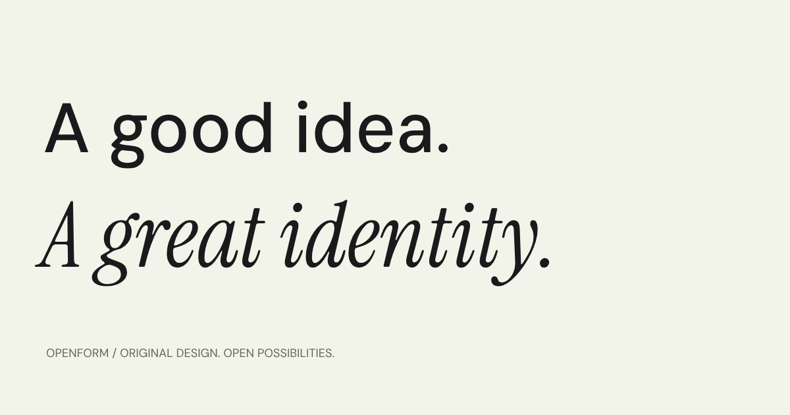

# Openform

### Open-source brand identity systems for people who want a better beginning.

[](https://github.com/arssshi/openform/actions/workflows/check.yml)
[](LICENSE)
[](LICENSE-ASSETS)
[](THIRD-PARTY-NOTICES.md)

Openform is an open-source library of **complete, original brand identity systems** — not a pile of logo marks and color swatches. Every identity has a point of view, a visual language, real applications, local fonts, a responsive website theme, and the documentation needed to use it in a real project.

**48 identities · 1,440 primary files · 48 installable themes · 20 font families · 8 visual styles · 9 collections**



**Explore the library:** [arssshi.github.io/openform](https://arssshi.github.io/openform) · **Source:** [github.com/arssshi/openform](https://github.com/arssshi/openform)

---

## Why Openform exists

Starting a product, studio, community, or personal project should not mean starting with an empty canvas. Good design gives an idea confidence and direction, but professional identity work is often expensive, slow to access, or reduced to a single logo.

Openform makes a stronger starting point available to everyone:

- **Complete enough to use:** marks, type, color, patterns, applications, guidelines, and web components belong to the same system.
- **Distinct by construction:** each identity has an authored concept, symbol, composition, artwork direction, palette, typographic voice, and usage logic.
- **Open by license:** original design assets are CC0; website and theme code are MIT; fonts retain their own SIL OFL notices.
- **Ready for the web:** every identity includes a scoped responsive CSS theme, local fonts, working HTML references, and optional React primitives.
- **Easy to hand to AI:** every kit includes a concrete `AI-PROMPT.md` with exact paths, measurements, component classes, implementation order, and acceptance checks.

This is design inspiration with a next step.

## What you get

Each identity kit contains **30 primary files**:

| Area | Included |
| --- | --- |
| Logo system | Mark, lockup, wordmark, monochrome logo, avatar, favicon |
| Original artwork | Signature illustration, pattern, identity board |
| Brand applications | Poster, social card, vertical story, stationery, packaging, website direction, business card |
| Visual specifications | Interface icon set, named palette, typography sheet |
| Design data | DTCG-style `tokens.json`, `theme.json`, `brand.json` |
| Website theme | Scoped responsive `theme.css`, local font declarations, component classes |
| Working references | `reference.html`, `components.html`, `theme.js` |
| Developer handoff | `components.tsx`, `install-theme.mjs`, `AI-PROMPT.md`, `INSTALL.md`, `guidelines.md` |

Fonts, original font notices, licenses, previews, and ZIP archives are supplementary files and are intentionally excluded from the primary-file count.

## Find a direction

Openform covers eight visual styles and nine collections. Start with the idea your project needs:

- **Minimal** — less, but better; clear geometry and useful restraint.
- **Organic** — grounded palettes, natural forms, and warm details.
- **Playful** — expressive shapes, confident color, and friendly energy.
- **Editorial** — strong typography, considered margins, and a point of view.
- **Futuristic** — precise systems for digital products and what comes next.
- **Brutalist** — direct composition, visible structure, and graphic conviction.
- **Elegant** — quiet surfaces, graceful type, and close-looking details.
- **Retro** — familiar warmth rebuilt for contemporary use.

Browse the curated collections in the website or search by name, mood, industry, color, hex value, font, concept, or product direction.

## Quick start

Requires **Node.js 22 or newer**.

```sh
git clone https://github.com/arssshi/openform.git
cd openform
npm install
npm run dev
```

Open the local URL printed by Vite, usually [http://localhost:5173](http://localhost:5173).

The generated identities and fonts are committed in this workspace, so the site can be explored immediately. To regenerate everything from source:

```sh
npm run fonts
npm run assets
npm run release
npm run dev
```

## Install a brand theme

Download any identity kit from the website, or use the generated ZIP in `public/downloads/`. Extract the kit somewhere your project or coding assistant can read.

### One command

From the extracted kit folder:

```sh
node install-theme.mjs --target "/absolute/path/to/your/project"
```

The installer copies the theme to:

```text
public/themes/<brand-id>/
```

For an existing Vite or plain HTML entry, attach the stylesheet and root scope automatically:

```sh
node install-theme.mjs \
  --target "/absolute/path/to/your/project" \
  --html index.html
```

For a static site whose public root is the project directory:

```sh
node install-theme.mjs \
  --target "/absolute/path/to/site" \
  --public-dir . \
  --html index.html
```

Optional React primitives:

```sh
node install-theme.mjs \
  --target "/absolute/path/to/your/project" \
  --react
```

The installer has no npm dependencies. It preflights the kit before copying, protects the original HTML with a one-time `.openform-backup`, and is safe to run again.

### Ask a coding assistant

Every kit includes a ready-to-use implementation prompt. Give your assistant the extracted folder and say:

> Install the Openform moss Edition 02 theme in this project. Read `AI-PROMPT.md` and `theme.json`, run `install-theme.mjs` against the project root, then follow `reference.html` and `components.html`. Preserve the existing content, routes, data, and functionality.

The prompt tells the assistant how to identify the framework, where to load the stylesheet, how to scope the theme, how to map existing components, which local assets to use, and how to verify the result. It does not ask the assistant to replace your application with a demo.

### Manual integration

Load the theme after broad reset/framework styles and apply the exact identity scope:

```html
<link rel="stylesheet" href="/themes/moss/theme.css">

<div data-openform="moss" class="of-theme">
  <main class="of-container of-section">
    
    <h1 class="of-display">Your real project headline.</h1>
    <p class="of-body">Your real project description.</p>
    <a class="of-button" href="/your-existing-route">Your real action</a>
  </main>
</div>
```

The exact theme contract is in `theme.json`. The CSS scope is always:

```css
[data-openform="<brand-id>"]
```

Keep the supplied `fonts/` directory next to `theme.css`. Preserve your existing routes, state, data fetching, providers, forms, and interaction handlers.

## The Openform website

The showcase is itself a production-quality reference for discovering and using the systems:

- Search and browse 48 identities by style, industry, collection, color, concept, and font.
- Save identities locally and keep saved selections synchronized across tabs.
- Open crawlable identity pages with overview, applications, assets, type playground, and theme installation sections.
- Preview large original applications and download individual files or complete kits.
- Copy palette values, installation requests, implementation prompts, and integration markup.
- Explore working theme references on desktop and mobile sizes.
- Use native accessible dialogs, keyboard navigation, visible focus, reduced-motion support, and responsive layouts.
- Discover the content without JavaScript: the production build prerenders 66 crawlable pages with unique metadata and structured data.

## Source layout

```text
src/
  components/              React interface and identity views
  data/                    Brand data, art directions, fonts, collections, assets
  lib/                     Catalogue, routes, metadata, and page helpers
  App.tsx                  Showcase shell and navigation
  showcase.css             Modern website presentation and responsive layout

scripts/
  lib/design.mjs           Font shaping, SVG, patterns, contrast helpers
  lib/symbols.mjs          Authored master logo silhouettes
  lib/artwork.mjs          Original signature illustrations
  lib/identity.mjs         Application and identity-board renderers
  lib/theme.mjs            Themes, references, components, and prompts
  generate-assets.mjs      Full identity and ZIP generator
  theme-installer.mjs      Portable installer source
  build-site.mjs           Client build, prerendering, metadata, sitemap
  validate-assets.mjs      Generated-library and archive validation
  validate-installer.mjs   Temporary-project installer tests
  validate-site.mjs        Production SEO and page validation

public/
  brands/<id>/              Generated identity kits and reference pages
  downloads/                Individual and complete-library ZIPs
  fonts/                   Self-hosted website fonts and notices
```

## Commands

| Command | Purpose |
| --- | --- |
| `npm run dev` | Start the Vite development server |
| `npm run fonts` | Fetch missing font files and original OFL notices |
| `npm run assets` | Generate SVGs, themes, references, prompts, installers, and ZIPs |
| `npm run previews` | Browser-parse SVGs and create visual review sheets |
| `npm run release` | Package public documentation and the source ZIP |
| `npm run check` | Type-check assets, archives, themes, fonts, prompts, and installer behavior |
| `npm test` | Run desktop/mobile browser, accessibility, interaction, download, and theme tests |
| `npm run build` | Build and prerender the production website, then validate SEO output |
| `npm run preview` | Preview the production build locally |

Install Chromium for browser verification:

```sh
npx playwright install --with-deps chromium
```

## Quality standards

Openform treats generated design as source code. The validation pipeline checks:

- unique symbol and illustration geometry;
- authored identity directions and distinct composition strategies;
- WCAG AA ink-on-paper and ink-on-accent text pairings;
- portable SVG envelopes with outlined typography and no external dependencies;
- local font files, original license notices, and CSS font paths;
- complete kit ZIPs and the full-library archive;
- exact theme scopes, manifests, references, prompts, and asset paths;
- optional generated React primitives with actual TypeScript checking;
- installer safety, idempotency, HTML backups, and custom public directories;
- production titles, descriptions, canonicals, Open Graph data, JSON-LD, robots, and sitemap output;
- desktop/mobile overflow, keyboard behavior, reduced motion, and automated accessibility.

Human visual review remains part of the standard. A unique identifier does not make a good identity by itself.

## Search-friendly publishing

Set the real public site URL before building. A GitHub Pages project site includes the repository path:

```sh
VITE_SITE_URL=https://arssshi.github.io/openform npm run build
```

The build produces:

- prerendered HTML for the homepage, every identity, style and collection pages, and the installation guide;
- unique titles, descriptions, canonicals, Open Graph images, Twitter cards, and JSON-LD;
- `robots.txt` and an absolute `sitemap.xml` when `VITE_SITE_URL` is set;
- `noindex, follow` handling for query-string search/filter states;
- identity-specific social preview images generated from local vector artwork.

### Publish this repository with GitHub Pages

This repository includes `.github/workflows/deploy-pages.yml`. It builds the prerendered site with the correct `/openform/` base path and deploys `dist/` whenever `main` changes.

1. Push `main` to [github.com/arssshi/openform](https://github.com/arssshi/openform).
2. Open **Settings → Pages** in the repository.
3. Under **Build and deployment**, choose **GitHub Actions** as the source.
4. Wait for the **Deploy Openform to GitHub Pages** workflow to finish.
5. Open [arssshi.github.io/openform](https://arssshi.github.io/openform).

The workflow uses `VITE_SITE_URL=https://arssshi.github.io/openform`, so generated canonicals, Open Graph URLs, robots metadata, and the sitemap point to the project site. If the repository is renamed, update that value in `.github/workflows/deploy-pages.yml` and `.env.example`.

Openform focuses on useful, accurate content rather than keyword stuffing, fabricated rankings, or fake popularity claims.

## Contributing

Read:

- [CONTRIBUTING.md](CONTRIBUTING.md) — contribution workflow and source conventions;
- [Design standards](docs/DESIGN-STANDARDS.md) — what makes a system complete and distinct;
- [Architecture](docs/ARCHITECTURE.md) — data, generation, themes, and publishing;
- [Roadmap](ROADMAP.md) — current capabilities and future work.

Useful contributions include original identity systems, accessibility improvements, theme improvements, documentation, generator tooling, and better ways to help people use the library. Please open an issue before investing in a large structural change.

## Licensing

| Work | License |
| --- | --- |
| Website code, theme CSS/JS/components, installer, and tooling | [MIT](LICENSE) |
| Original artwork, palettes, tokens, metadata, and guidelines | [CC0 1.0](LICENSE-ASSETS) |
| Font software | SIL Open Font License 1.1; notices included with each font |

Attribution is appreciated but not required for the original CC0 artwork. Font redistribution retains its own license obligations. Brand names are fictional concepts and are not trademark-clearance guarantees.

The four supplied research images at the project root are review references only. They are excluded from the public site, downloadable source archive, generated assets, and asset license.

## Find Openform on GitHub

If the library helps you start a project, a star, issue, pull request, or shared example helps other designers and developers find it. The most valuable contribution is a real use case: show what you made, explain what you changed, and help the next person begin with more confidence.

**Repository:** [github.com/arssshi/openform](https://github.com/arssshi/openform)

---

**Distinct identities. Open possibilities.**
